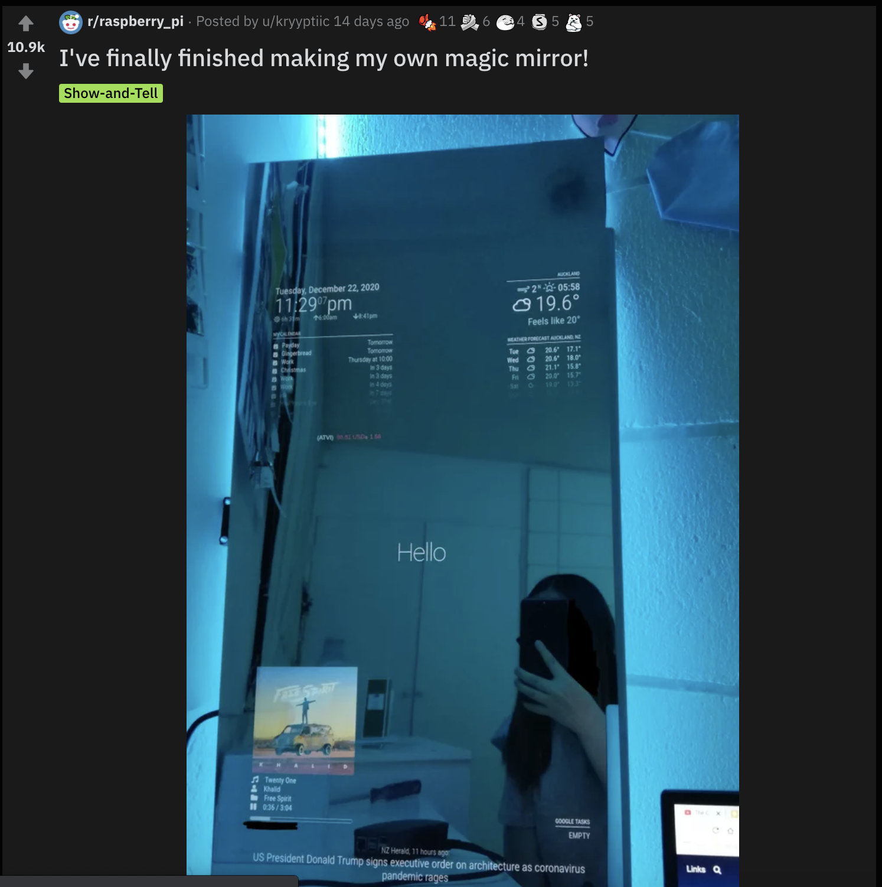
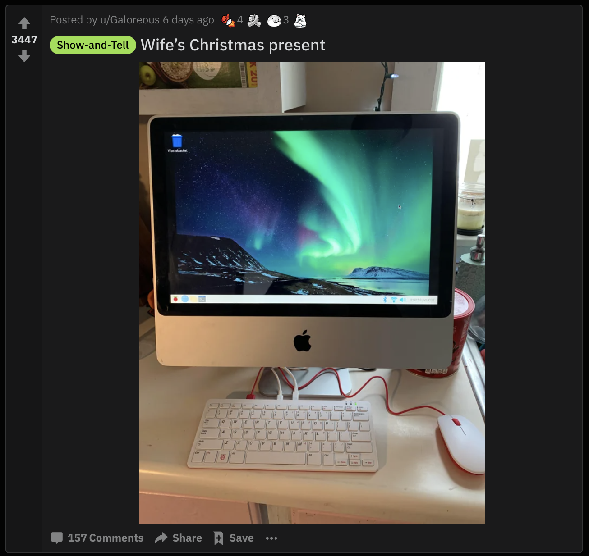
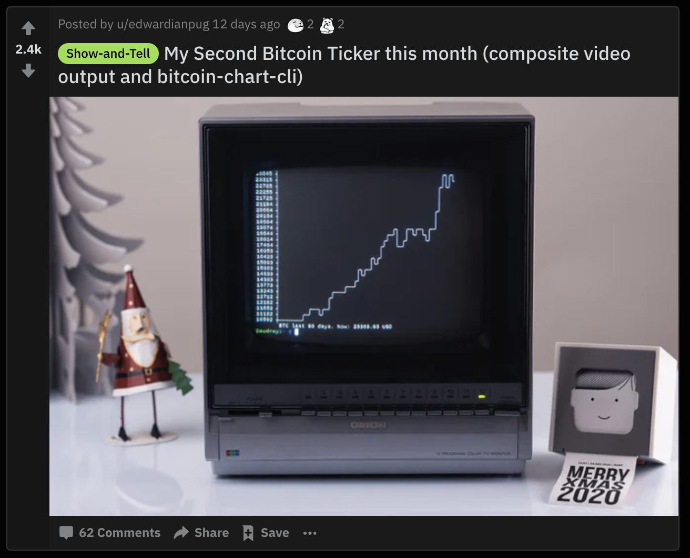
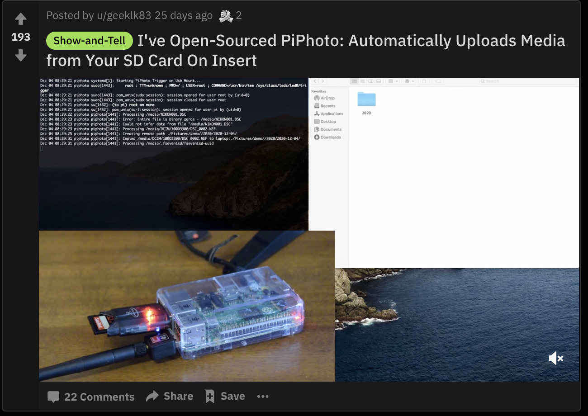
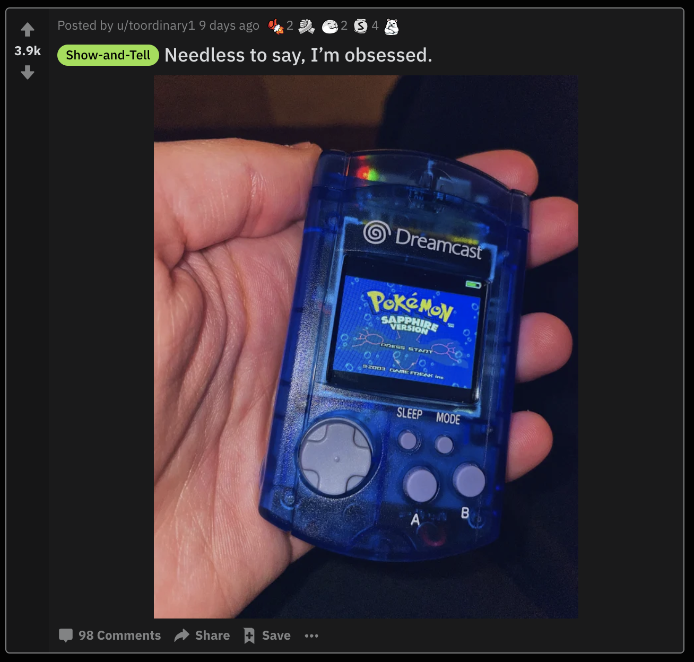

## Overview

Here is a full guide to the top 5 best raspberry projects from Reddit in January 2021. All of these projects came from the Raspberry Pi subreddit [/r/raspberry_pi](https://www.reddit.com/r/raspberry_pi/). I frequently visit this subreddit and wanted to showcase some awesome community driven projects. Leave a comment down below with your favorite Raspberry Pi projects for January 2021.

## #5 - Magic Mirror Build

The magic mirror is such an awesome project for people just getting started with Raspberry Pi. The [magic mirror](https://magicmirror.builders/) is easy to build, the software is rock solid and it has a huge community of people improving it all the time. The magic mirror with Raspberry Pi is actually what introduced me to the hobby a few years ago.

In this particular magic mirror build the user has a calendar of events displayed, the weather, spotify and news reporting at the bottom. The reason the magic mirror with Raspberry Pi is such a great project is because of its extensibility. Developers from the magic mirror community are continually adding new plugins to enhance its set of features.

## #4 - Raspberry Pi 400 "Mac" Build

This is another really cool Raspberry Pi project from the subreddit. The project uses the brand new [Raspberry Pi 400](https://www.raspberrypi.org/products/raspberry-pi-400/). The Raspberry Pi 400 is a Raspberry Pi 4 that is enclosed in a keyboard. Simply plugin a monitor and mouse and you instantly have a full working computer!

This particular user was able to repurpose an old Mac screen that they had laying around. They hooked up the screen to the Raspberry Pi 400 and turned it into an inexpensive home computer. I can't wait to see what other people use the Raspberry Pi 400 for in the future. It is such a neat and practical computer.

## #3 - Bitcoin Price Tracker with Raspberry Pi

This next project has a retro vibe to a simple Bitcoin price tracker. With the price of Bitcoin skyrocketing this month, this is a really unique and relevant project that is great for beginners. The project simply runs in the terminal window and displays a nice chart with the current price of Bitcoin.

For some reason, the idea of mixing new technology (Raspberry Pi) with old technology (CRT monitor) is really appealing to me. If you have a leftover screen or monitor, I highly consider turning it into a data display with a Raspberry Pi.

## #2 - Practical SD Card File Transfer for Raspberry Pi

This next project is a very practical project for people like photographers who need to upload files from a SD quickly. The project is called PiPhoto and the user has linked [the code on their GitHub](https://github.com/lou-k/pi-photo-sync) for other people to use. I can see this being a useful project to many different users so I had to showcase it in the top Raspberry Pi projects on Reddit for January 2021.

With the source code included by the creator, this is another great Raspberry Pi project for beginners. Be sure to check out the creator's GitHub page if you want to make this awesome device for yourself.

## #1 - Raspberry Pi Mini "Dreamcast" Handheld Gaming Console

My favorite project showcased on the Raspberry Pi subreddit for January 2021 is this crystal blue mini "Dreamcast" gaming console. The project uses a Raspberry Pi zero as the internals and [the kit to build it can be found here](https://markypigaming.com/).

The best part about this build is just how small it is! I mean look at that thing, it fits perfectly in the users hand. This is truly a portable console that can run retro games in the palm of your hand.