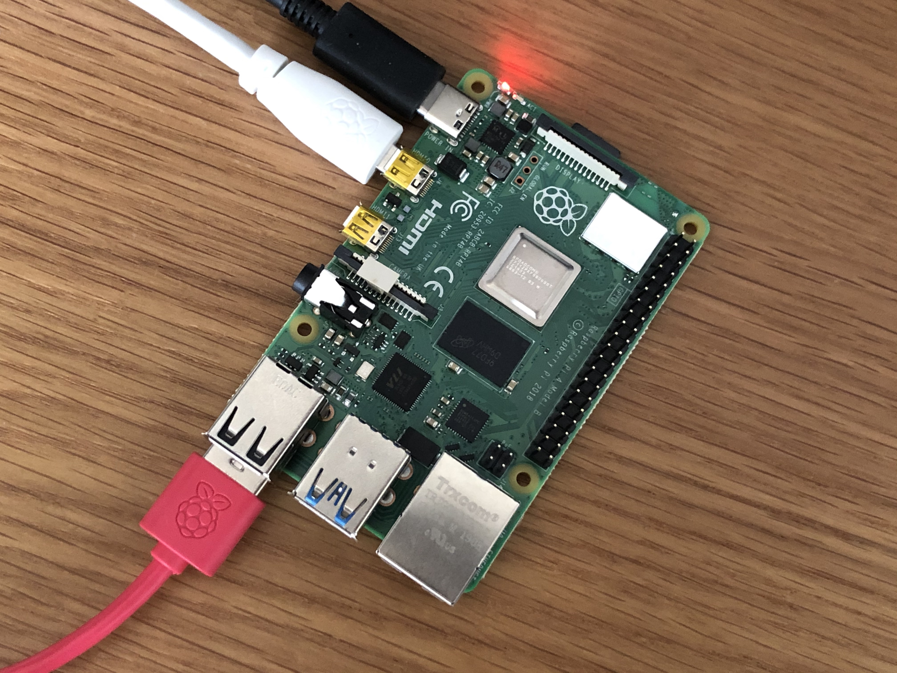
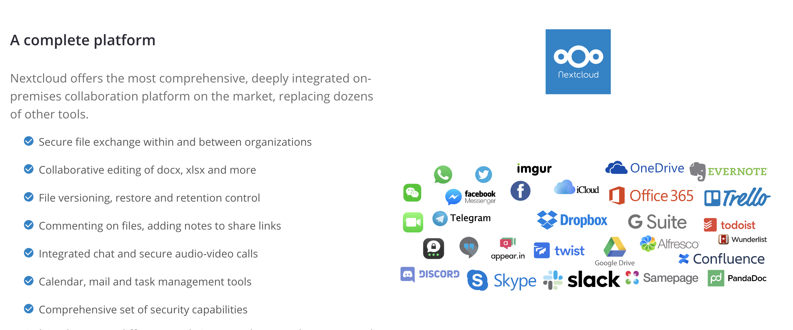
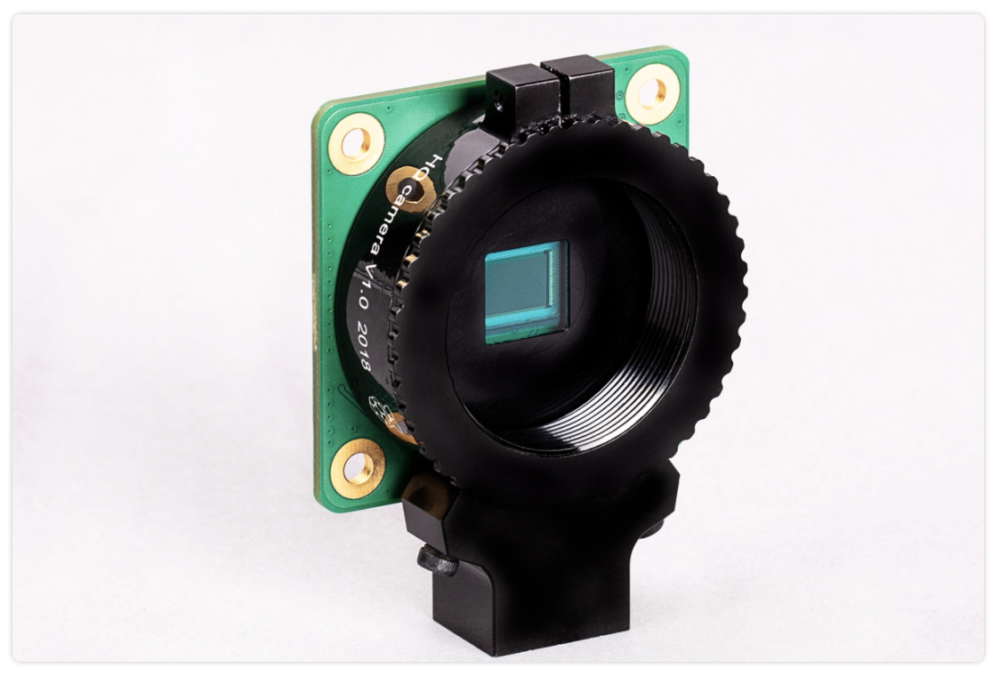
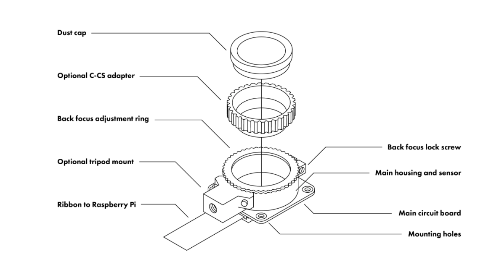
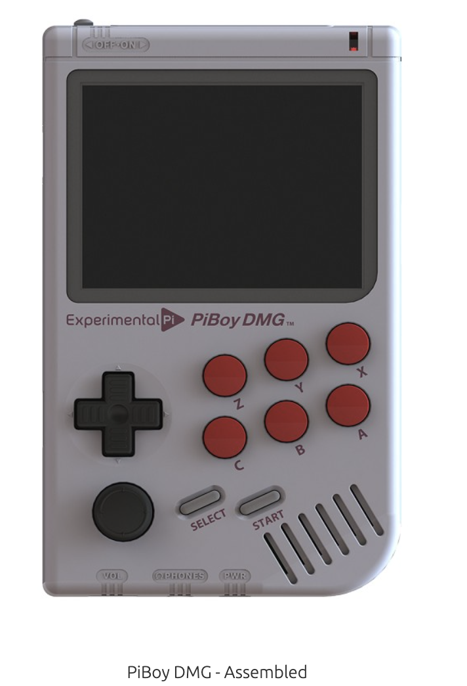

## Overview 🍓

This is a list of three cool things to do with a Raspberry Pi. The Raspberry Pi has quickly become a programmer and hobbyist dream computer because of its size and capability. With just a little bit of python knowledge you can create really cool things with a Raspberry Pi.

## #3 - Personal Cloud Server ☁️

With everything being stored in the "cloud" these days, people have found a way to use Raspberry Pi for personal cloud storage. With the popularity of services such as Dropbox, Google Drive, and Amazon Web Services, cloud storage is in high demand. With a Raspberry Pi and a bit of technical knowledge just about anyone can create a private cloud server to store photos, documents and other media.

[NextCloud](https://nextcloud.com/) is the service that a lot of Raspberry Pi users have used to turn their computer into a cloud server. Setting up NextCloud on a Raspberry Pi can allow users to access files from anywhere. The main benefit to a private cloud is that you would have control and complete ownership of your files and information.

## #2 - Raspberry Pi High Quality Camera 📷

Another really cool project that has gained a lot of people's interest is building a high quality camera with Raspberry Pi. The Raspberry Pi 4 and other models have built in support for attaching a high quality camera. The things you can do with a camera attached to a Raspberry Pi are pretty remarkable. For example, here are some ideas for utilizing the HQ camera:

* Timelapse camera
* Object recognition with machine learning
* Long exposure camera for nighttime photography

The [high quality camera for Raspberry Pi](https://www.raspberrypi.org/products/raspberry-pi-high-quality-camera/) has been in really high demand recently. I have been wanting to find one to pickup for my own personal projects but have had trouble getting my hands on one.

## #1 - Raspberry Pi Handheld Retro Game Console 🎮

One of the most popular projects for Raspberry Pi is to turn it into a retro game console using [RetroPie](https://retropie.org.uk/). Using RetroPie allows users to emulate popular games and consoles such as the N64, Super Nintendo, & GameBoy to name a few. 

Over the past few years there have been many companies that build full kits for building handheld gaming consoles with Raspberry Pi. One of my favorites is called the [PiBoy DMG](https://www.experimentalpi.com/PiBoy-DMG--Assembled_p_16.html)

## What Are Your Favorite Raspberry Pi Projects? 

Leave a comment on this post and start a discussion about your favorite Raspberry Pi projects!