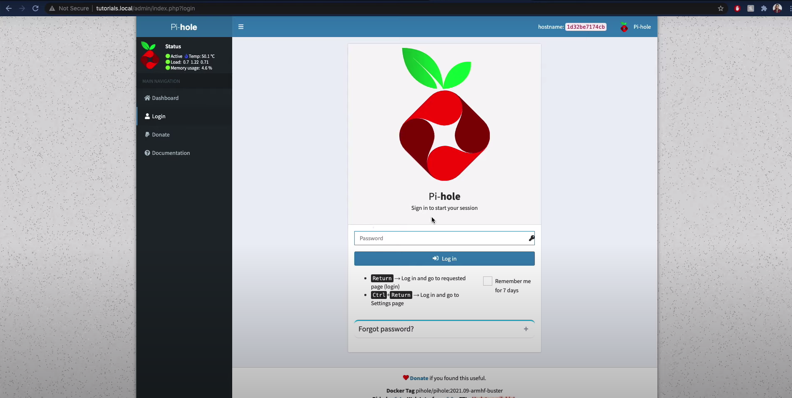

## Video Tutorial
`youtube: https://www.youtube.com/watch?v=kwuHPUNevqU&ab_channel=RyanWard`

## Overview

In this guide I will show you how to block ads on the network level in your home using a Raspberry Pi, [Docker](https://www.docker.com/) and [Pi-Hole](https://pi-hole.net/).

## Prerequisites

Before you start the tutorial make sure you have your Raspberry Pi connected to the internet. Additionally you need to make sure that SSH is enabled for your Raspberry Pi. Lastly, make sure you have installed Docker on the Raspberry Pi.

Here are tutorials if you need help with those:
`youtube: https://www.youtube.com/watch?v=wJ5Ii0uT4Mk&t=2s&ab_channel=RyanWard`

[How to Enable SSH on Raspberry Pi](https://www.ryanwardtech.com/guides/how-to-ssh-into-raspberry-pi/)

## Install Docker Compose

The first thing we have to do is to install docker-compose on the Raspberry Pi:

```
sudo apt-get install docker-compose
```

## Create Docker Compose File to Start Pi-Hole

First we are going to make a directory to store our docker-compose.yml file:

```
mkdir -p workspace/pihole
```

Next, we need to create the following file **docker-compose.yml**

```
cd workspace/pihole
touch docker-compose.yml
vim docker-compose.yml
```

Edit the docker-compose.yml and paste the following into it:

```
version: "3"

# More info at https://github.com/pi-hole/docker-pi-hole/ and https://docs.pi-hole.net/
services:
  pihole:
    container_name: pihole
    image: pihole/pihole:latest
    ports:
      - "53:53/tcp"
      - "53:53/udp"
      - "67:67/udp"
      - "80:80/tcp"
    environment:
      TZ: 'America/Chicago'
      WEBPASSWORD: 'admin'
    # Volumes store your data between container upgrades
    volumes:
      - './etc-pihole/:/etc/pihole/'
      - './etc-dnsmasq.d/:/etc/dnsmasq.d/'
    # Recommended but not required (DHCP needs NET_ADMIN)
    #   https://github.com/pi-hole/docker-pi-hole#note-on-capabilities
    cap_add:
      - NET_ADMIN
    restart: unless-stopped
```

**Note:** You should change the value of WEBPASSWORD to be the password you wish to use for the admin panel.

Save the docker-compose.yml file.

## Start Pi-Hole Docker Container

Next we are going to use the docker-compose.yml file to create the running docker container for pi-hole

```
docker-compose up -d
```

## Use the Pi-Hole Admin Page

Now that the pi-hole container has been started we can navigate to the page.
Open the web browser of your choice and enter the hostname or IP address of your Raspberry Pi followed by **/admin**

For example:

```
http://raspberrypi.local/admin
```

You should see the following screen:

