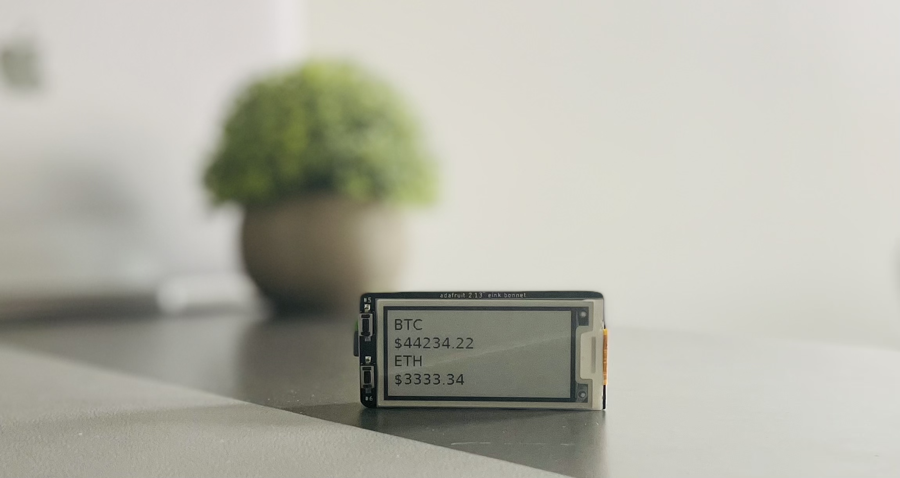
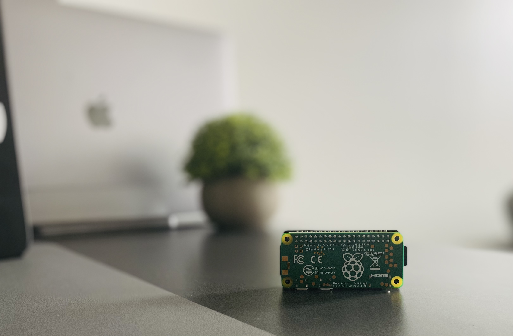

## Video Tutorial
`youtube: https://www.youtube.com/watch?v=SPy3oCn1JmY&t=27s&ab_channel=RyanWard`

## Overview
This is a fun project with a [Raspberry Pi](https://www.raspberrypi.org/) and an [e-ink](https://www.adafruit.com/product/4687) display to track the current price of Bitcoin and other cryptocurrencies. Here is an image of what the final product looks like: 





## Required Hardware for CryptoPi
| Price      | Item                                         | Total Price                                                                                  |
| :--------- | :------------------------------------------- | :------------------------------------------------------------------- |
| **$14.00** | [Raspberry Pi Zero WH (Zero W with Headers)](https://www.adafruit.com/product/3708)   |
| **$19.95** | [2.13" E-Ink Bonnet for Raspberry Pi](https://www.adafruit.com/product/4687)   |
| **$14.99** | [32GB Micro SD Card Pack](https://www.amazon.com/PNY-Elite-microSDHC-Memory-3-Pack/dp/B07YXJM282/ref=sr_1_18?crid=3GICE52988A25&dchild=1&keywords=micro+sd+card&qid=1609606176&s=electronics&sprefix=micro+%2Celectronics%2C201&sr=1-18)                      |                             |
|            |                                              | **$48.94 + tax & shipping** |

## Setup CryptoPi Display with Raspberry Pi
In order to run the software required to display the price of Bitcoin you will first need to make sure you have Git installed on your Raspberry Pi.

In order to install Git on the Raspberry Pi, simply run the following in the terminal:

```
$ sudo apt-get install git
```

Next we are going to clone [my repository named cryptopi](https://github.com/ryanwa18/cryptopi) from Github:

```
$ git clone https://github.com/ryanwa18/cryptopi.git
```

Next we are going to change directory into the newly cloned repository:

```
$ cd cryptopi
```

Lastly we are going to start the program to display the price of Bitcoin and Ethereum:

```
$ python display_price.py
```

## Thanks for Reading
Thank you for reading my full build guide for CryptoPi. If you liked it [please consider subscribing to my YouTube channel](https://www.youtube.com/channel/UCv09vbalH7G--ILCkG3l28Q?sub_confirmation=1) for more content like this!

