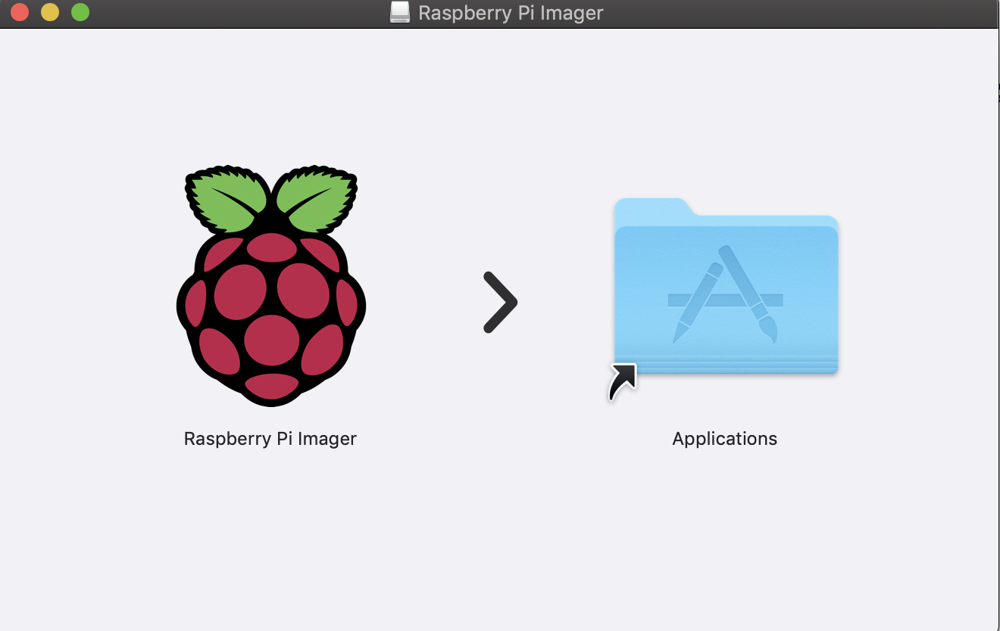
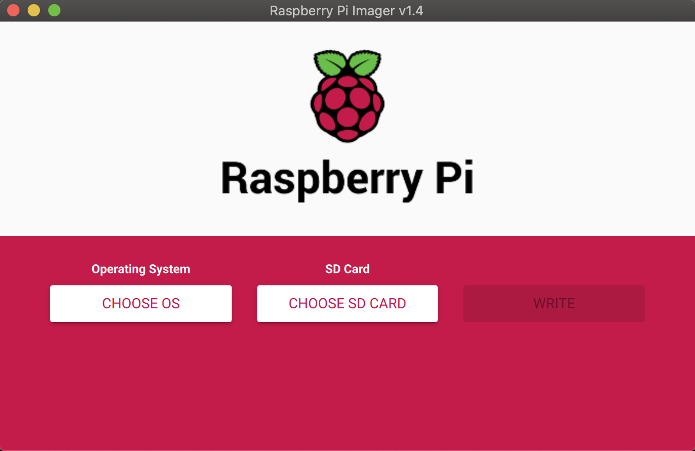
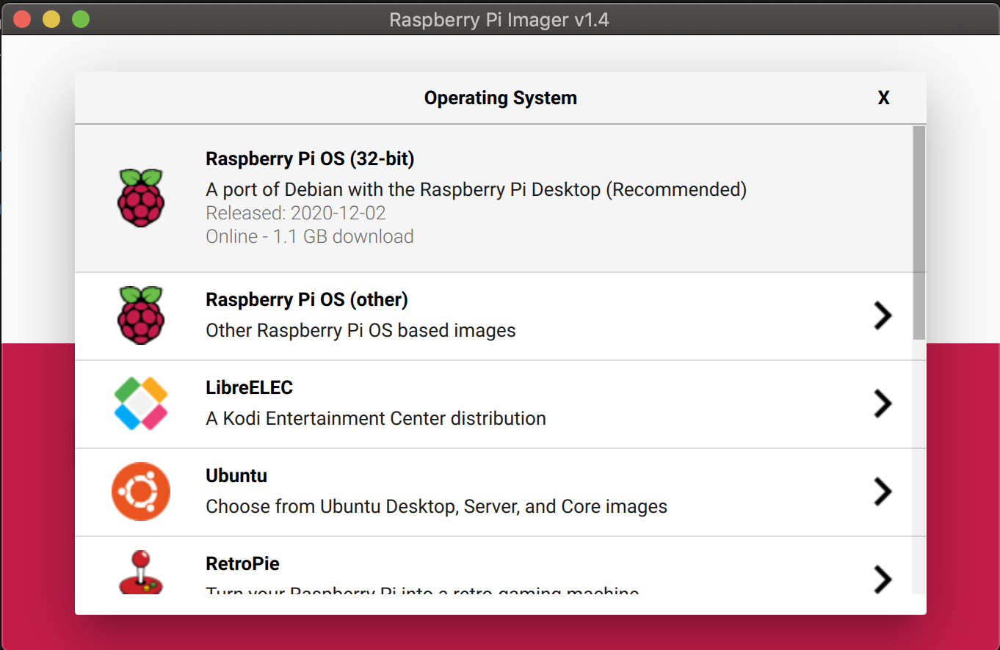

## Overview

In this full guide, I will show you how to install Raspberry Pi OS on a SD card using a mac or macbook. Installing Raspberry Pi OS on a micro sd card is the first step when setting up a new Raspberry Pi.

## Steps

### 1 - Download and Install Raspberry Pi OS Imager for Mac

The first thing you need to do is [download the Raspberry Pi OS imager for mac](https://downloads.raspberrypi.org/imager/imager_1.5.dmg). This is a great utility for easily imaging a micro SD card with different operating systems for Raspberry Pi. The utility can be used to image a micro SD card with operating systems such as:

* Raspberry Pi OS
* RetroPie
* Ubuntu

The Raspberry Pi imager can be found on [the Raspberry Pi website](https://www.raspberrypi.org/software/). 

Once the `.dmg` file has been downloaded, open it up and you will be prompted to install the Application.

### 2 - Plug in Micro SD Card to Mac

This step is pretty simple, just plug in the micro SD card you plan to use for your Raspberry Pi. **Note that using the Raspberry Pi imager will erase anything stored on the micro SD card.** If you have important files on the SD card be sure to back it up before using the Raspberry Pi imager.

### 3 - Open Raspberry Pi Imager

Next you are going to want to navigate to `Applications` on your mac. Find the `Raspberry Pi Imager` application and open it.

### 4 - Select the SD Card Plugged into the Mac

Next go ahead and click `CHOOSE SD CARD` and select your micro SD card plugged in.

### 5 - Select the Raspberry Pi OS of Choice

Lastly go ahead and select the Raspberry Pi OS of your choice to be put on the micro SD card. Personally, I recommend the 32bit Raspberry Pi OS if you are just getting started. 

