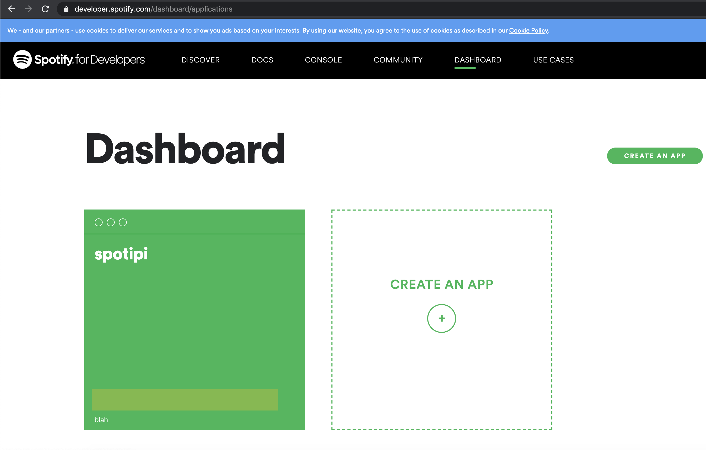
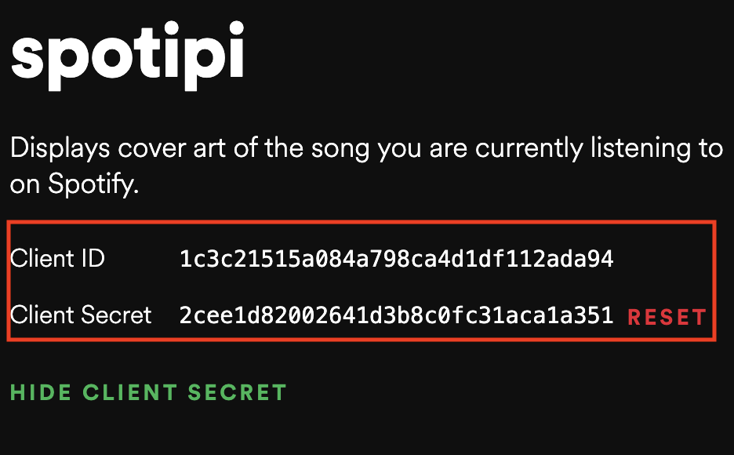
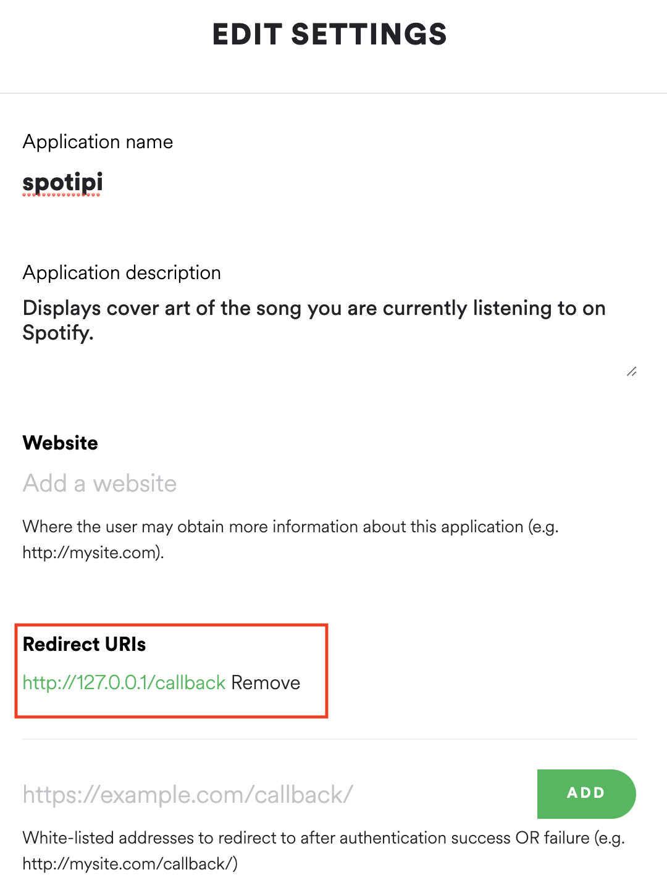

## Overview
This project is to display the cover art of any song you are listening to on a led matrix from the Spotify web api. This has been a huge passion project of mine and I am glad to see that other people have been interested in it as well. Here is what the finished project will look like once it is built:


## Required Hardware for SpotiPi
Before you begin building SpotiPi there are a few items you will need to purchase. The total price for this build is around $95 USD.

| Price      | Item                                         | Total Price                                                                                  |
| :--------- | :------------------------------------------- | :------------------------------------------------------------------- |
| **$39.99** | [32x32 RGB LED Matrix Panel - 6mm pitch](https://www.adafruit.com/product/1484)       |                             |
| **$14.95** | [Adafruit RGB Matrix Bonnet for Raspberry Pi](https://www.adafruit.com/product/3211)  |                             |
| **$14.00** | [Raspberry Pi Zero WH (Zero W with Headers)](https://www.adafruit.com/product/3708)   |                             |
| **$9.99**  | [5V/4A 20W Switching Power Supply Adapter](https://www.amazon.com/gp/product/B01N4HYWAM/ref=ppx_yo_dt_b_asin_title_o05_s00?ie=UTF8&psc=1)     |                             |
| **$14.99** | [32GB Micro SD Card Pack](https://www.amazon.com/PNY-Elite-microSDHC-Memory-3-Pack/dp/B07YXJM282/ref=sr_1_18?crid=3GICE52988A25&dchild=1&keywords=micro+sd+card&qid=1609606176&s=electronics&sprefix=micro+%2Celectronics%2C201&sr=1-18)                      |                             |
|            |                                              | **$93.92 + tax & shipping** |


## Setup Hardware for SpotiPi
Before installing the SpotiPi software you will need to assemble the hardware. The setup is really simple and will just need some beginner level soldering jobs. If you want to learn how to use a soldering iron, checkout [this YouTube video](https://www.youtube.com/watch?v=oqV2xU1fee8&ab_channel=electronhacks).

### Soldering Job (Beginner Level)
In order to reduce flickering of the screen it is **highly** recommended to perform the following hardware modifications.

#### Modification #1

This first modification requires soldering a connecting wire between GPIO pins 4 and 18 on the rgb matrix bonnet.

#### Modification #2 (Only for 64x64 panels)

The next modification is required **only for 64x64 rgb matrix panels**. If you are using a 32x32 rgb matrix, you can ignore this step.

The modification requires 

### Connecting Components

## Installing SpotiPi Software
After the hardware has been assembled and powered on, you are now ready to install the SpotiPi software. This installation is assuming you have already installed Raspbian OS on your Raspberry Pi and can connect to it with ssh, vnc or mouse & keyboard. If you need instructions on how to install Raspbian OS on any Raspberry Pi, [I have written this guide to help out with that.](https://ryanwardtech.com/guides/how-to-install-raspbian-on-sd-card-mac/)

### Create Spotify Developer Application
In order to access the Spotify web API you must have a Spotify account. Once you have a Spotify account, you will need to create a new application within the [Spotify developer dashboard](https://developer.spotify.com/dashboard/applications).



Next you are going to want to **take note of the Spotify Client ID and Spotify Client Secret** in your new application. You will need these during future parts in the setup process for SpotiPi.



Lastly, you will need to edit the application and set the redirect uri to something like http://127.0.0.1/callback 



### Generate Spotify Authentication File

Before logging into the raspberry pi, you will need to generate an authentication token. To do this, you are going to want to clone my [SpotiPi repository](https://github.com/ryanwa18/spotipi) on your main computer with access to a web browser.

```
$ git clone  https://github.com/ryanwa18/spotipi.git
```

Next go ahead and change into the directory that the git clone created.

```
$ cd spotipi
```

Run the generate token script and enter the prompted Spotify credentials saved in the previous step.

```
$ bash generate-token.sh
```

This will generate a file named `.cache-<username>`

### Copy Authentication File to Raspberry Pi

Next, scp this file over to your raspberry pi, for example:

```
$ scp .cache-<username> pi@spotipy.local:/home/pi
```

Clone the [SpotiPi repository](https://github.com/ryanwa18/spotipi) to your raspberry pi. **Make sure these remaining steps are done on your raspberry pi.** You can ssh into the raspberry pi, use vnc or just attach a monitor and keyboard.

```
$ git clone https://github.com/ryanwa18/spotipi.git
```

### Move Authentication File to Proper Directory on Raspberry Pi

Move the token file to the repository directory root.

```
$ mv <path_to_cache_file> <path_to_cloned_repository>
```

### Run the Installation Script to Complete the Build

Install the SpotiPi software on your raspberry pi. Follow the steps on the screen and entered the values when prompted.

* **Spotify Client ID:** the token created on the Spotify developer dashboard
* **Spotify Client Secret:** the secret token created on the Spotify developer dashboard
* **Spotify username:** the username for your Spotify account
* **Spotify Redirect URI:** the redirect uri set within the Spotify developer dashboard
* **Full path to your spotify token:** the path to where you stored the spotify authentication file on your raspberry pi. (**for example: /home/pi/spotipi/.cache-ryanwa18**)

```
$ cd spotipi
$ sudo bash setup.sh
```

Edit settings on the web app to match your hardware. Open your web browser and navigate to the following link.

```
http://<raspberrypi_hostname or ip_address>
```

Within the web interface, you can perform the following actions:
* Turn the display on or off.
* Adjust the brightness of the display.
* Adjust the size of the display if you are using a 64x64 matrix.

## Thanks for Reading
Thank you for reading my full build guide for SpotiPi. If you liked it [please consider subscribing to my YouTube channel](https://www.youtube.com/channel/UCv09vbalH7G--ILCkG3l28Q?sub_confirmation=1) for more content like this!
