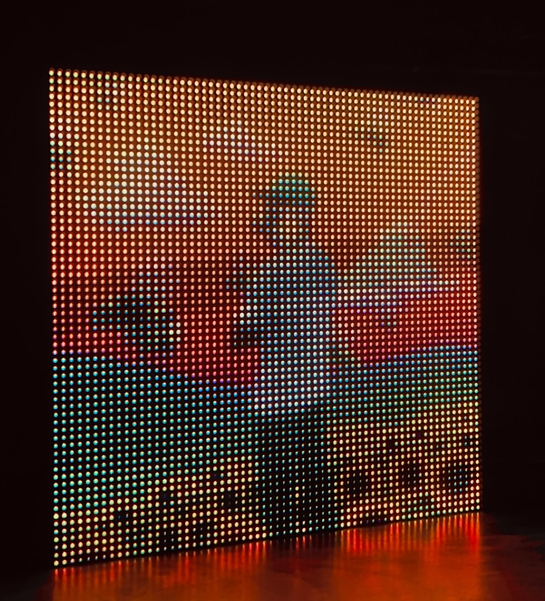
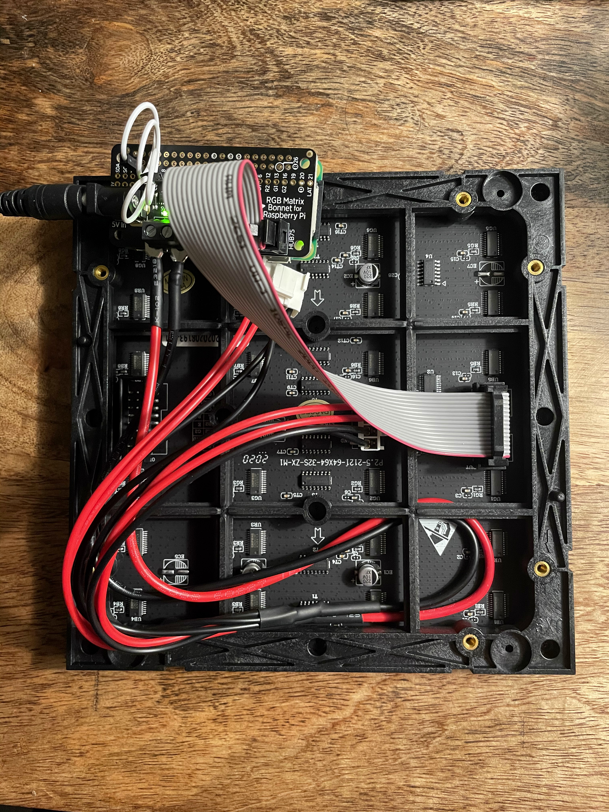

## Overview
This project is to display the cover art of any song you are listening to on a led matrix from the Spotify web api. This has been a huge passion project of mine and I am glad to see that other people have been interested in it as well. Here is what the finished project will look like once it is built:




## Required Hardware for SpotiPi
Before you begin building SpotiPi there are a few items you will need to purchase. The total price for this build is around $95 USD.

| Price      | Item                                         | Total Price                                                                                  |
| :--------- | :------------------------------------------- | :------------------------------------------------------------------- |
| **$39.99** | [32x32 RGB LED Matrix Panel - 6mm pitch](https://www.adafruit.com/product/1484)       |                             |
| **$14.95** | [Adafruit RGB Matrix Bonnet for Raspberry Pi](https://www.adafruit.com/product/3211)  |                             |
| **$14.00** | [Raspberry Pi Zero WH (Zero W with Headers)](https://www.adafruit.com/product/3708)   |                             |
| **$9.99**  | [5V/4A 20W Switching Power Supply Adapter](https://www.amazon.com/gp/product/B01N4HYWAM/ref=ppx_yo_dt_b_asin_title_o05_s00?ie=UTF8&psc=1)     |                             |
| **$14.99** | [32GB Micro SD Card Pack](https://www.amazon.com/PNY-Elite-microSDHC-Memory-3-Pack/dp/B07YXJM282/ref=sr_1_18?crid=3GICE52988A25&dchild=1&keywords=micro+sd+card&qid=1609606176&s=electronics&sprefix=micro+%2Celectronics%2C201&sr=1-18)                      |                             |
|            |                                              | **$93.92 + tax & shipping** |



## Setup Hardware for SpotiPi
Before installing the SpotiPi software you will need to assemble the hardware. The setup is really simple and will just need some beginner level soldering jobs. If you want to learn how to use a soldering iron, checkout [this YouTube video](https://www.youtube.com/watch?v=oqV2xU1fee8&ab_channel=electronhacks).

### Soldering Job (Beginner Level)
In order to reduce flickering of the screen it is **highly** recommended to perform the following hardware modifications.

#### Modification #1

#### Modification #2

### Connecting Components

## Installing Spotipi Software
After the hardware has been assembled and powered on, you are now ready to install the SpotiPi software.
### Create Spotify Developer Application
* Create a new application within the [Spotify developer dashboard](https://developer.spotify.com/dashboard/applications) <br />
* Edit the settings of the application within the dashboard.
    * Set the redirect uri to any local url such as http://127.0.0.1/callback

### Generate Spotify Authentication File
* Before logging into the raspberry pi, you will need to generate an authentication token.
* To do this, you are going to want to clone my spotipi repository on your main computer with access to a web browser.
```
$ git clone  https://github.com/ryanwa18/spotipi.git
```
* Next go ahead and change into the directory using 
```
$ cd spotipi
```
* Run the generate token script and enter the prompted spotify credentials using
```
$ bash generate-token.sh
```
* This will generate a file named `.cache-<username>`
* You are going to want to scp this file over to your raspberry pi, for example:
```
$ scp .cache-<username> pi@spotipy.local:/home/pi
```
* Clone the repository to your raspberrypi
```
$ git clone https://github.com/ryanwa18/spotipi.git
```
* Move the token file to the repository root
```
$ mv <path_to_cache_file> <path_to_cloned_repository>
```
* Install the software: <br />
```
$ cd spotipi
$ sudo bash setup.sh
```
* Edit settings on the web app: <br />
```
navigate to http://<raspberrypi_hostname or ip_address> within a web browser
```
