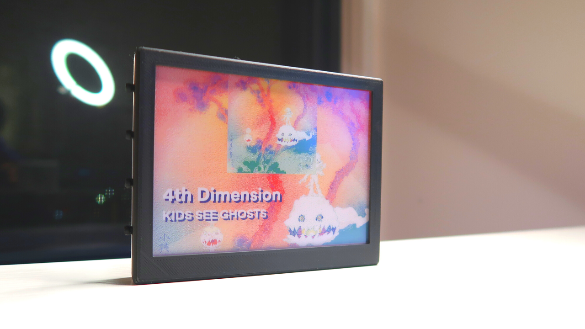
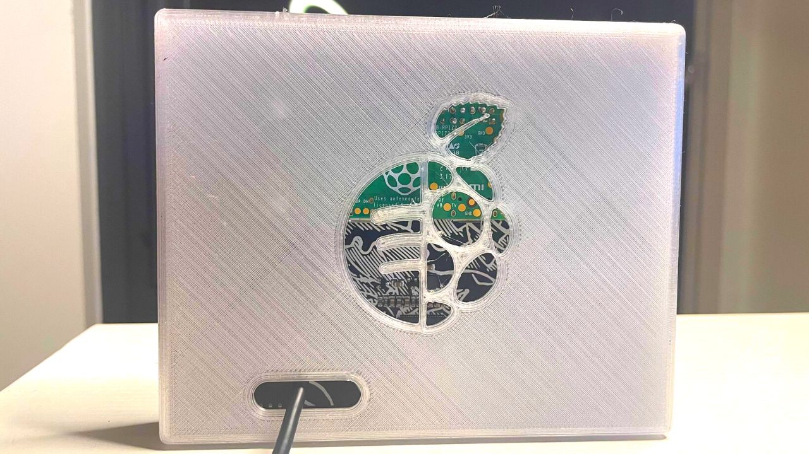
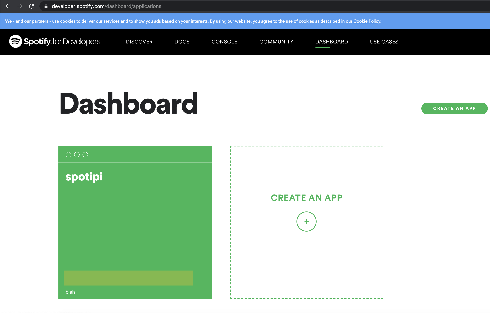
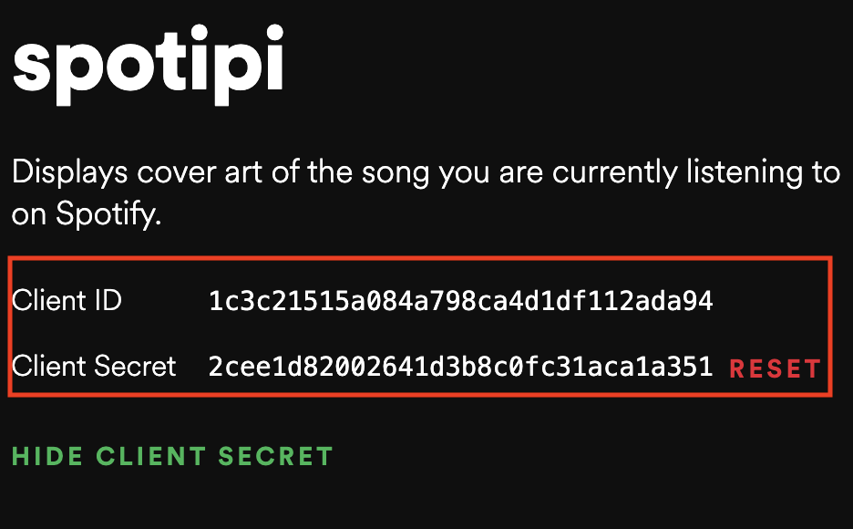
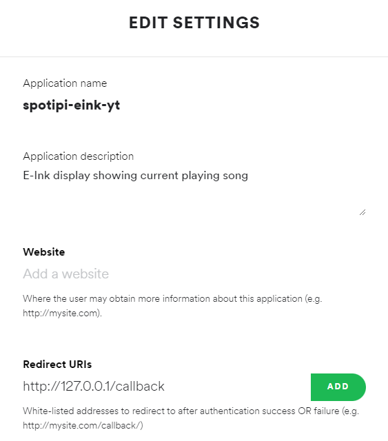
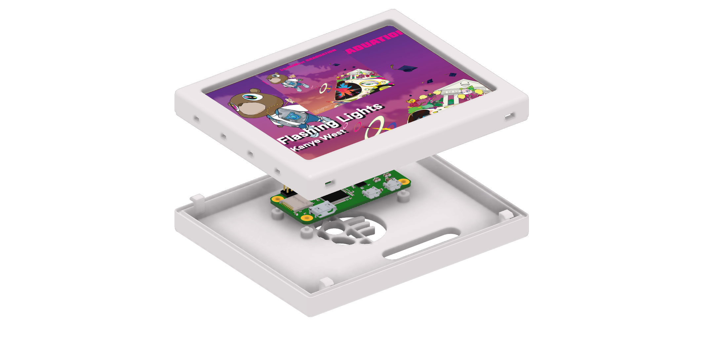

## Video Tutorial

`youtube: https://www.youtube.com/watch?v=uQYIAYa27ds&t=6s&ab_channel=RyanWard`

## Overview
This project is to display the cover art of any song you are listening to on an e-ink display from the Spotify web api. This has been a huge passion project of mine and I am glad to see that other people have been interested in it as well. Here is what the finished project will look like once it is built:





## Required Hardware for SpotiPi
Before you begin building SpotiPi there are a few items you will need to purchase. The total price for this build is around $95 USD.

| Price      | Item                                         |
| :--------- | :------------------------------------------- | :------------------------------------------------------------------- |
| **£69.90** | [Inky Impression 5.7" - 7 colour ePaper/eInk HAT](https://shop.pimoroni.com/products/inky-impression-5-7?variant=32298701324371)       |                             |
| **$15** | [Raspberry Pi Zero 2 W](https://www.raspberrypi.com/products/raspberry-pi-zero-2-w/)  |                             |
| **$14.99** | [32GB Micro SD Card Pack](https://www.amazon.com/PNY-Elite-microSDHC-Memory-3-Pack/dp/B07YXJM282/ref=sr_1_18?crid=3GICE52988A25&dchild=1&keywords=micro+sd+card&qid=1609606176&s=electronics&sprefix=micro+%2Celectronics%2C201&sr=1-18)                      |                             |

## Installing SpotiPi Software
After the hardware has been assembled and powered on, you are now ready to install the SpotiPi software. This installation is assuming you have already installed Raspbian OS on your Raspberry Pi and can connect to it with ssh, vnc or mouse & keyboard. If you need instructions on how to install Raspbian OS on any Raspberry Pi, [I have written this guide to help out with that.](https://ryanwardtech.com/guides/how-to-install-raspbian-on-sd-card-mac/)

### Create Spotify Developer Application
In order to access the Spotify web API you must have a Spotify account. Once you have a Spotify account, you will need to create a new application within the [Spotify developer dashboard](https://developer.spotify.com/dashboard/applications).



Next you are going to want to **take note of the Spotify Client ID and Spotify Client Secret** in your new application. You will need these during future parts in the setup process for SpotiPi.



Lastly, you will need to edit the application and set the redirect uri to something like http://127.0.0.1/callback 




### Run the Installation Script to Complete the Build

Install the SpotiPi software on your raspberry pi. Follow the steps on the screen and enter the values when prompted.

* **Spotify Client ID:** the token created on the Spotify developer dashboard
* **Spotify Client Secret:** the secret token created on the Spotify developer dashboard
* **Spotify username:** the username for your Spotify account
* **Spotify Redirect URI:** the redirect uri set within the Spotify developer dashboard
* **Full path to your spotify token:** the path to where you stored the spotify authentication file on your raspberry pi. (**for example: /home/pi/spotipi-eink/.cache**)

```
$ sudo bash setup.sh
```

### 3D Printed Case

If you are interested in printing the case and buttons that I used please checkout [my cults3d profile](https://cults3d.com/en/users/rwardtech/creations).



## Thanks for Reading
Thank you for reading my full build guide for SpotiPi. If you liked it [please consider subscribing to my YouTube channel](https://www.youtube.com/channel/UCv09vbalH7G--ILCkG3l28Q?sub_confirmation=1) for more content like this!
