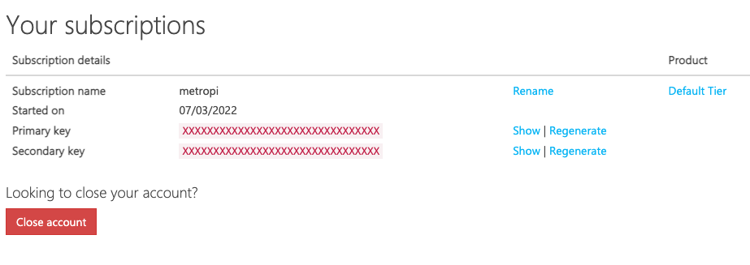

## Video Tutorial

`youtube: https://www.youtube.com/watch?v=y1iDtT6QzH4&t=1s&ab_channel=RyanWard`

## Overview

Learn how to display live information about Washington D.C. metro trains powered with a raspberry pi.

## Required Hardware

Before you begin, make sure you have all the necessary components to build metropi. You can use any Raspberry Pi for this project, as long as it has the GPIO headers soldered. **The price is heavily dependent on the current price of raspberry pis.**

| Price      | Item                                         | Total Price                                                                                  |
| :--------- | :------------------------------------------- | :------------------------------------------------------------------- |
| **~ $100** | [Raspberry Pi 4](https://amzn.to/3AGLneb)       |                             |
| **$19.99** | [Adafruit E-Ink Bonnet](https://www.adafruit.com/product/4687)  |                             |
| **$20** | [128GB Micro SD Card)](https://amzn.to/3RkuDiG)   |                             |
|            |                                              | *~ $140 USD + tax & shipping** |

### Install Raspberry Pi OS

`youtube: https://www.youtube.com/watch?v=3oNRXSiVhfk&ab_channel=RyanWard`

The first thing you need to do is to flash the SD card with the Raspberry Pi OS.

It is relatively straightforward and I have a tutorial to do this here: [https://www.ryanwardtech.com/guides/how-to-install-raspbian-on-sd-card-mac/](https://www.ryanwardtech.com/guides/how-to-install-raspbian-on-sd-card-mac/)

## Assemble Components

* First go ahead and insert the micro SD card into your raspberry pi.
* Next, plug the e-ink display into the GPIO header pins on your raspberry pi.
* Lastly, plug in your micro USB or USB-C cable to power your raspberry pi.


## Generate WMATA API Key

Next, we are going to register with WMATA developer to create a project API key. This API key will be used to interact with WMATA's backend to retrieve the live metro data.

* Create an account with WMATA developer here: [https://developer.wmata.com/](https://developer.wmata.com/)
* Next, navigate to [https://developer.wmata.com/Products](https://developer.wmata.com/Products) and select "Default Tier"
* Next, click "Add Subscription" to create a new project.
* Lastly, give your project a name such as "metropi" and agree to the terms and conditions.



You now have successfully generated an API key for the project. Copy the value in the table labeled "Primary Key" and save it for later.

## Software Setup

Next we are going to load the necessary software onto the raspberry pi. Make sure you are running all the commands from the command line of your raspberry pi. You can either use SSH to login remotely or just use the normal pi interface and open the "terminal" application.

* First, we need to clone my GitHub repo with the code:
```
git clone https://github.com/ryanwa18/metropi.git
```

* Next we are going to change into the metropi repository:
```
cd metropi
```

* Next we need to create a python virtual environment:
```
python3 -m venv . && source bin/activate && pip install -r requirements.txt
```

* Next we need to create a new file named ```.env``` in the metropi directory. In this file we are going to copy the following into it:
```
METRO_API_KEY = 'YOUR_METRO_API_KEY'
```

**Make sure to replace inside the quotes with the Primary Key from the previous step.**

* Lastly, we are going to run the program:
```
python3 main.py
```

## Software Configuration

* If you want to change the station that the code tracks replace ```line 22``` in ```main.py``` with the station code you want to use.
* Station codes can be found in the JSON file here: [Washington Metro Station Codes](https://developer.wmata.com/docs/services/5476364f031f590f38092507/operations/5476364f031f5909e4fe3311?)
